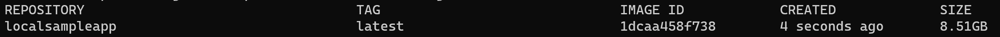
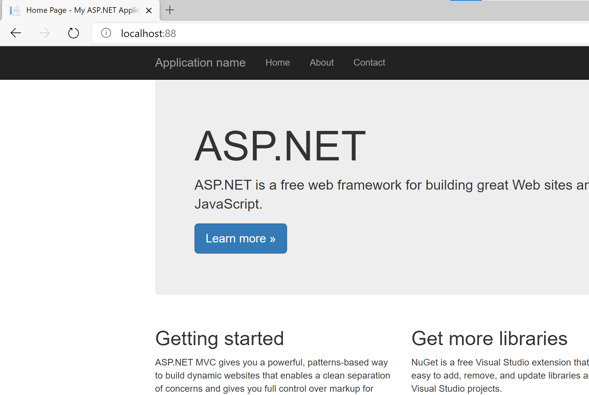
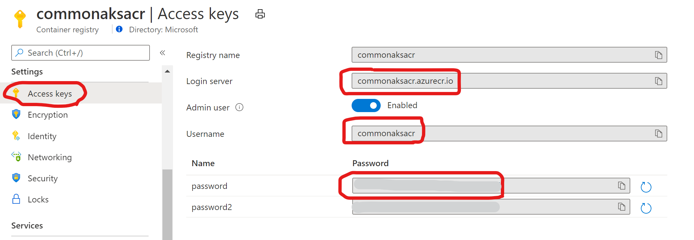
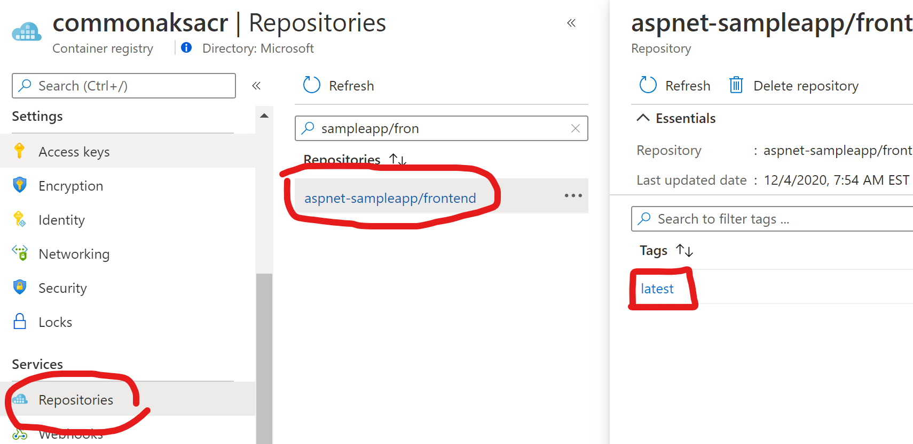
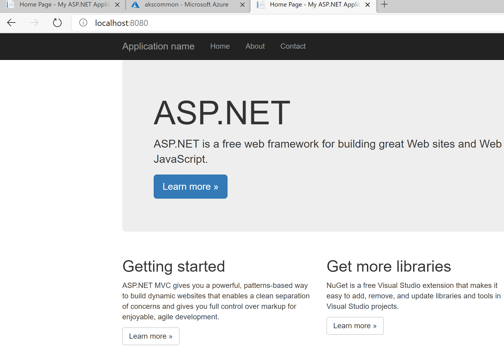

Quick demo about how to containerize an ASP.NET app (Framework) and deploy to aks

# Manual approach
## Build image

This is one example of a multi-stage Dockerfile

````Dockerfile
FROM mcr.microsoft.com/dotnet/framework/sdk:4.8 as build
WORKDIR /src
COPY . .
#RUN dir  #for debugging
RUN nuget restore SampleApp.sln
RUN msbuild SampleApp.sln /p:OutputPath=c:\published /p:PublishProfile=FolderProfile


FROM mcr.microsoft.com/dotnet/framework/aspnet:4.8-windowsservercore-ltsc2019
WORKDIR /inetpub/wwwroot
COPY --from=build /published/_PublishedWebsites/SampleApp .
#RUN dir   #for debugging
````

To build the image, we should be located at /src folder and run:

````bash
docker build -t localsampleapp .
````
>Once we need to push it to a registry, the tag should have the form of the container registry/repository, like **myregistry.azurecr.io/sampleapp:version1**

Once we built the image, we should see a localsampleapp image in our local image repository:

````bash
docker images
````


## Test container

To test locally, we should run

````bash
docker run -p 88:80 localsampleapp:latest
````

After a moment, we should be able to access to localhost:port like in the following picture:


## Push the image to a container registry

First, you should login to the container registry. In case of ACR, you should get these values:



After that, we will be able to login:

````bash
docker login commonaksacr.azurecr.io
Username: commonaksacr
Password: *********
Login Succeeded
````

Once we are logged in, we will push the image. 
Since during the previous step we created an image, we should do the same, but now the name of the image should have the form of **[container registry]/[repository]/[containername]:[tag]**: 

````bash
docker build -t commonaksacr.azurecr.io/aspnet-sampleapp/frontend:latest .

docker push commonaksacr.azurecr.io/aspnet-sampleapp/frontend:latest
````

After this operation, we should see the image available at the container registry:



## Deploy to AKS 

For testing purposes, we can deploy just a [pod](yaml/simple-pod.yaml), in the most basic form like this:

````yaml
apiVersion: v1
kind: Pod
metadata:
  name: sampleapp-frontend
  labels:
    name: sampleapp-frontend
spec:
  containers:
  - name: sampleapp-frontend
    image: commonaksacr.azurecr.io/aspnet-sampleapp/frontend:latest
    resources:
      requests:
        memory: "300Mi"
        cpu: "500m"
      limits:
        memory: "1024Mi"
        cpu: "1000m"
    ports:
      - containerPort: 80
  nodeSelector:
    kubernetes.io/os: windows
  tolerations:
    - key: "os"
      operator: "Equal"
      value: "windows"
      effect: "NoSchedule"
````

Once we have access to our cluster, we can deploy this example just applying the pod definition

````bash
kubectl apply -f simple-pod.yaml
````

After a while (first time can take time), we should see something like this:

````bash
kubectl get pod
NAME                         READY   STATUS    RESTARTS   AGE
sampleapp-frontend           1/1     Running   0          13m
````

To verify the application and access to the running container, we can do a port-forward:

````bash
kubectl port-forward pod/sampleapp-frontend 8080:80
````

As result, we should see a page like this, now running on AKS:



# Pipeline Approach

# Ingress Controller
